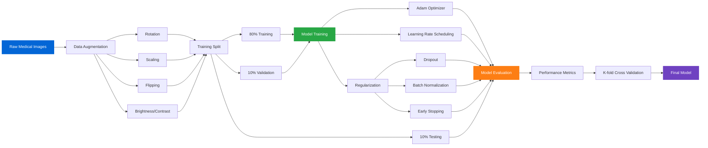

# Kidney Disease Detection

Our kidney disease detection system utilizes a fine-tuned **InceptionResNetV2 model** for comprehensive renal imaging analysis.

#### 🎯 Detection Categories
- **Kidney Cysts** - Fluid-filled sacs detection
- **Kidney Stones** - Mineral deposit identification
- **Kidney Tumors** - Benign and malignant growth detection
- **Normal Kidney** - Healthy tissue classification

#### 🔧 Technical Specifications
- **Base Architecture:** InceptionResNetV2
- **Input Resolution:** 244×244 pixels
- **Training Dataset:** Comprehensive kidney imaging dataset
- **Classification Output:** 4 categories with confidence scores

---
## 📈 Model Performance

| Model | Accuracy | 
|-------|----------|
| Kidney Disease Detection | 99.52% | 

---

### Model Training Pipeline

---
